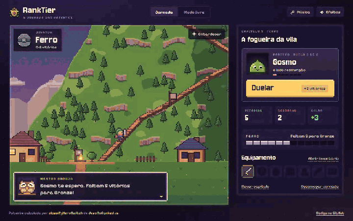
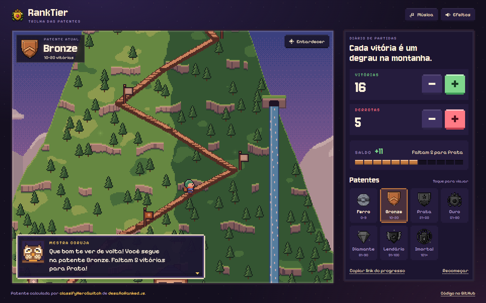
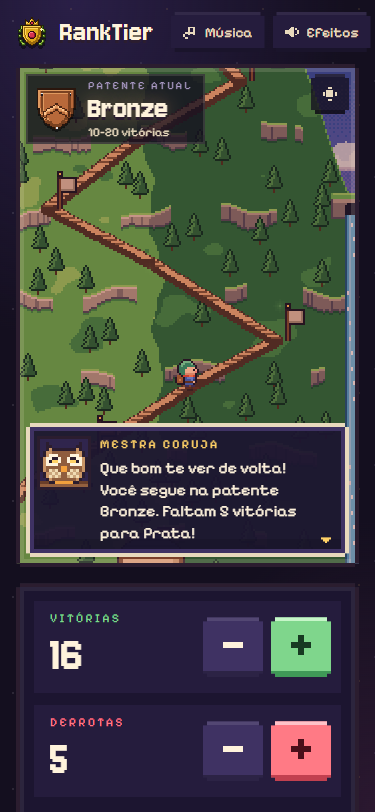

# RankTier

Um joguinho pixel art em que cada vitória é um passo montanha acima, do Ferro, na vila ao pé da montanha, até o templo Imortal lá no topo.

**[Ver ao vivo](https://leandromlmoreira.github.io/ranktier/)**



| Desktop | Celular |
| --- | --- |
|  |  |

## Funcionalidades

- **Montanha com parallax em camadas**: céu com dithering, cordilheira distante, nuvens, colinas, a montanha com terraços, cachoeira e pinheiros, e arbustos em primeiro plano, cada camada em uma velocidade.
- **Ciclo de luz**: o dia passa sozinho de entardecer para noite e amanhecer. As janelas da vila acendem uma a uma, surgem vagalumes, estrelas e lanternas nas estações da trilha. O botão de hora avança para a próxima fase.
- **Personagem com spritesheet próprio**, desenhado pixel a pixel em canvas, com animação de caminhada, respiração parada e pulo de comemoração.
- **Escadaria de patentes**: a trilha em zigue-zague tem uma estação por patente. O herói anda até a posição exata do seu progresso dentro da faixa atual e a câmera acompanha.
- **Emblema detalhado para cada patente** (escudo de ferro rebitado, brasão de bronze, prata com estrela, ouro com coroa e louros, diamante lapidado, lendário alado e imortal em chamas), gerados em canvas.
- **Subida de patente com festa**: explosão de partículas, tremida de câmera, faixa "Nova patente" e fanfarra.
- **Caixa de diálogo estilo RPG** com efeito de máquina de escrever: a Mestra Coruja avisa "Faltam 3 vitórias para Ouro!" e comenta cada vitória ou derrota.
- **Trilha e efeitos 8-bit** gerados na hora com WebAudio (desligados por padrão).
- **Controles grandes para o dedo**: botões de 60 px, segure para repetir acelerando, campo numérico editável, atalhos de teclado (↑ e ↓) e toque em qualquer emblema para viajar até ele.
- **Progresso salvo** no navegador e link compartilhável com `?vitorias=57&derrotas=12`.

A patente é sempre calculada pela função real `classifyHeroSwitch` do arquivo [`desafioRanked.js`](desafioRanked.js), importada direto pelo front (sem duplicar a regra).

## Stack

- **Front-end**: TypeScript + Vite, Canvas 2D e WebAudio, sem framework e sem imagens externas (toda a arte é gerada em código)
- **Fontes**: Jersey 10 e Pixelify Sans (Google Fonts)
- **Lógica**: JavaScript (Node.js), sem dependências
- **Testes**: test runner nativo do Node (`node:test`)
- **Deploy**: GitHub Pages via GitHub Actions

## Como rodar

```bash
git clone https://github.com/leandromlmoreira/ranktier.git
cd ranktier/web
npm install
npm run dev
```

Para gerar a versão de produção: `npm run build` (saída em `web/dist`).

## A regra das patentes

| Vitórias | Patente |
|----------|---------|
| 0–9      | Ferro |
| 10–20    | Bronze |
| 21–50    | Prata |
| 51–80    | Ouro |
| 81–90    | Diamante |
| 91–100   | Lendário |
| 101+     | Imortal |

O saldo é `vitórias - derrotas`. A biblioteca traz cinco implementações equivalentes (`switch`, ternário encadeado, array + `find`, laço `for` e recursão), todas intercambiáveis:

```js
const { classifyHeroSwitch } = require('./desafioRanked')

classifyHeroSwitch(18, 5)
// { balance: 13, level: 'Bronze' }
```

## Testes

```bash
npm test
```

Valida as bordas de todas as faixas e o cálculo de saldo nas cinco implementações.

## Licença

MIT, veja [LICENSE](./LICENSE).

---

<sub>Base: desafio de lógica de programação em JavaScript da Digital Innovation One (DIO).</sub>
