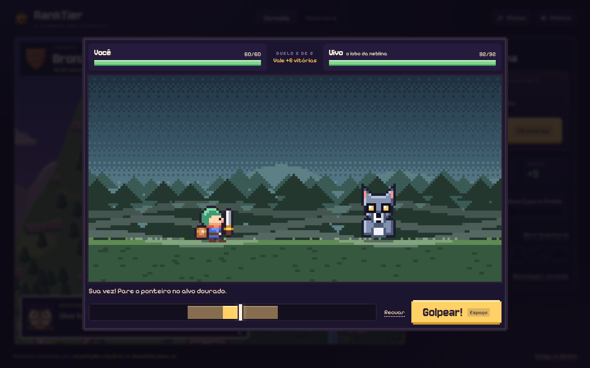
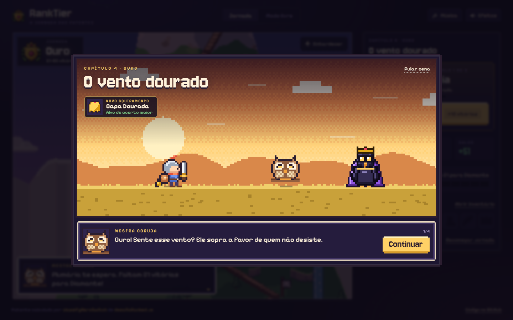
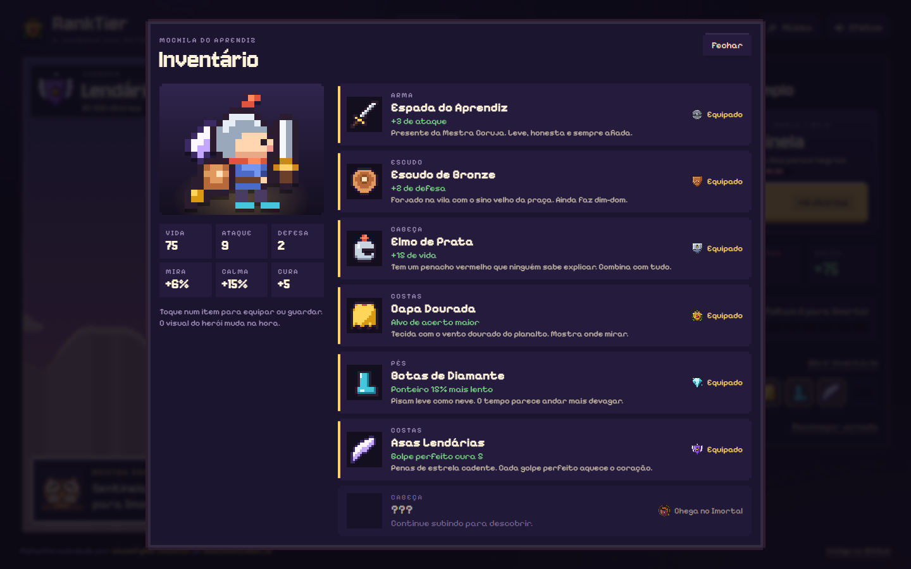

# RankTier

Um RPG pixel art de duelos rápidos: você sobe a montanha do Ferro ao Imortal, ganha um equipamento a cada patente e traz de volta a Chama do Topo que o Rei Corvo levou.

**[Jogar agora](https://leandromlmoreira.github.io/ranktier/)**


| Trilha | Celular |
| --- | --- |
|  |  |

| Duelo | História | Inventário |
| --- | --- | --- |
|  |  |  |

## Como se joga

- **Duelos de 30 a 60 segundos, por turnos e com timing.** Na sua vez, pare o ponteiro no alvo dourado: no centro é golpe perfeito (dano dobrado), na faixa é golpe bom. Na vez do inimigo, defenda quando o golpe chegar à marca: bloqueio perfeito zera o dano. Funciona com toque (a tela inteira do duelo é um botão), mouse e teclado (Espaço ou Enter; Esc recua).
- **Cada vitória vale vitórias de verdade.** Um duelo vencido soma vitórias à sua ficha e a patente é calculada pela função `classifyHeroSwitch` do [`desafioRanked.js`](desafioRanked.js). Derrotas somam derrotas e mexem no saldo, mas não derrubam a patente.
- **Dificuldade crescente.** A cada patente o ponteiro fica mais rápido, o alvo mais estreito e o inimigo mais forte. São 14 duelos até o Imortal; depois disso, os Desafios Imortais seguem abertos com revanches reforçadas.
- **Uma história em sete capítulos.** Prólogo, um capítulo por patente e um epílogo no templo, com a Mestra Coruja como guia e o Rei Corvo como antagonista. As cenas curtas aparecem entre as patentes e podem ser revistas.
- **Equipamento que muda o herói.** Espada do Aprendiz, Escudo de Bronze, Elmo de Prata, Capa Dourada, Botas de Diamante, Asas Lendárias e Coroa Imortal. Cada peça aparece no sprite (na trilha, no duelo e nas cenas) e dá um bônus: ataque, defesa, vida, alvo maior, ponteiro mais lento ou cura no golpe perfeito. No inventário dá para equipar e guardar cada item.
- **Progresso salvo no navegador**, com opção de recomeçar a jornada.
- **Modo livre**: a calculadora de patentes continua lá, para anotar partidas de verdade, com link compartilhável (`?vitorias=57&derrotas=12`).
- **Trilha e efeitos 8-bit** gerados na hora com WebAudio (desligados por padrão).

## Por dentro

- Toda a arte é desenhada em código: herói com camadas de equipamento, sete inimigos pintados com máscaras e sombreamento, sete cenários de duelo com céu em dithering e animações, além da montanha com ciclo de luz.
- A regra do jogo é lógica pura, sem DOM, em `web/src/game/`: combate (`combat.ts`), inimigos e dificuldade (`foes.ts`), equipamentos (`gear.ts`), progresso da jornada e save (`journey.ts`) e o roteiro (`story.ts`). Tudo isso é testado com `node:test`, inclusive uma simulação de balanceamento que garante duelos de 5 a 10 rodadas e um chefe final justo.

## Stack

- **Front-end**: TypeScript + Vite, Canvas 2D e WebAudio, sem framework e sem imagens externas
- **Fontes**: Jersey 10 e Pixelify Sans (Google Fonts)
- **Lógica**: JavaScript (Node.js), sem dependências
- **Testes**: test runner nativo do Node (`node:test`), rodando TypeScript direto (Node 23.6 ou mais novo)
- **Deploy**: GitHub Pages via GitHub Actions

## Como rodar

```bash
git clone https://github.com/leandromlmoreira/ranktier.git
cd ranktier/web
npm install
npm run dev
```

Para gerar a versão de produção: `npm run build` (saída em `web/dist`).

## A regra das patentes

| Vitórias | Patente |
|----------|---------|
| 0–9      | Ferro |
| 10–20    | Bronze |
| 21–50    | Prata |
| 51–80    | Ouro |
| 81–90    | Diamante |
| 91–100   | Lendário |
| 101+     | Imortal |

O saldo é `vitórias - derrotas`. A biblioteca traz cinco implementações equivalentes (`switch`, ternário encadeado, array + `find`, laço `for` e recursão), todas intercambiáveis:

```js
const { classifyHeroSwitch } = require('./desafioRanked')

classifyHeroSwitch(18, 5)
// { balance: 13, level: 'Bronze' }
```

## Testes

```bash
npm test
```

Valida as bordas de todas as faixas e o cálculo de saldo nas cinco implementações, além da lógica do jogo (timing, dano, bloqueio, dificuldade, equipamentos, progresso, cenas e save).

## Licença

MIT, veja [LICENSE](./LICENSE).

---

<sub>Base: desafio de lógica de programação em JavaScript da Digital Innovation One (DIO).</sub>
